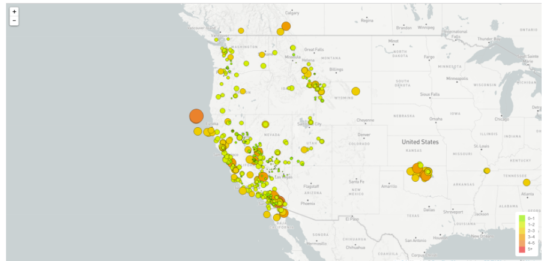

# Leaflet.js Earthquakes

# Background
This project uses Leaflet.js library along with html to produce a map that visualizes where an earthquake event occured. The data for this project is taken from the United States Geological Survey (USGS) in GeoJSON summary format.  The USGS updates the data every 5 minutes.  The data for this project is therefore updated since d3 is bringing in the data from a USGS url.  

The earthquakes are plotted based on the longitude and latitude contained in the dataset.  In addition to locating the earthquakes, the markers on the map reflects the magnitude of the earthquake in size and color.  Larger magnitude earthquakes will have a larger marker on the map and its color will trend toward red on the color scale.  

When clicked, each marker contains a popup that gives detail on where the earthquake occured and its exact magnitude.  For a quick overview, a legend was included which shows how the color of the markers correspond to the magnitude of the earthquake.  

# Map Preview

